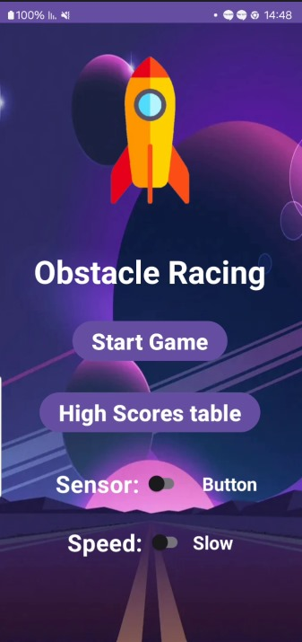
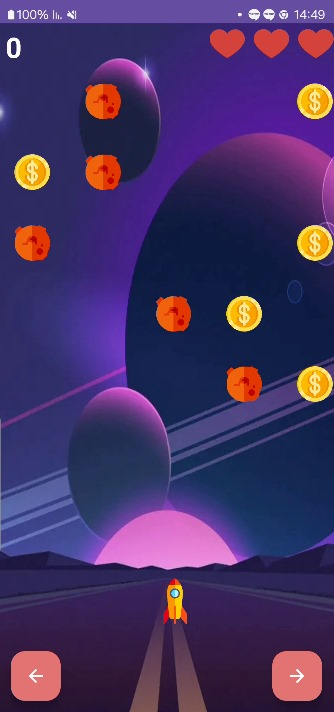
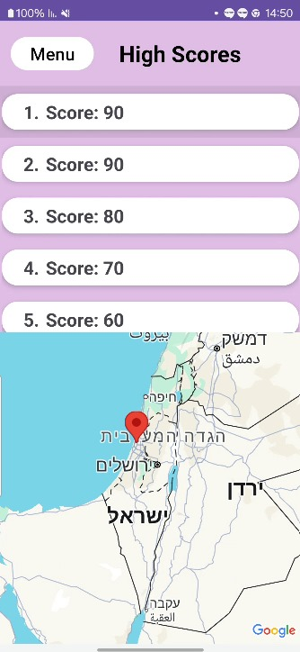

# **GameApp**

A game created as part of a Mobile Applications course project.

---

## **How to Run**

To use this app, ensure all necessary dependencies are installed on your system. No special API keys are required.

---

## **Overview**

**GameApp** is a fun and interactive game designed for Android devices, featuring intuitive controls and customizable settings to enhance user experience.

---

## **App Flow**

### **1. Main Menu**

The Main Menu provides access to the primary features of the game.  
**Available options:**
- **Start Game**: Starts the game loop with the settings selected by the user.
- **Control Mode**: Toggle between movement using the **sensor** or **buttons**.
- **Speed Setting**: Choose between **high** or **low** game speed.
- **Scoreboard**: Opens the scoreboard to view high scores.

---

### **2. Game Screen**

The Game Screen is the main gameplay area.  
**Features include:**
- Motion controls using the device's accelerometer (optional).
- Speed adjustments based on user settings.
- Collecting coins during the game to accumulate points.
- Music that plays upon collision with an obstacle.
- Real-time interactive backgrounds and animations.

---

### **3. Scoreboard Screen**

The Scoreboard Screen allows players to view their achievements and top scores.  
**Features include:**
- **Top Scores Table**: Displays the top 10 highest scores.
- **Map Integration**: Shows the locations where high scores were achieved.
- **Return to Main Menu**: A button to return to the main menu for easy navigation.

---

## **Technical Highlights**

- Built using **Kotlin 2.1.0** for Android.
- Utilizes **SharedPreferences** for saving scores.
- **Motion Controls**: Detects device tilt using an accelerometer.
- **Collision Music**: Plays appropriate sound effects upon collision.
- **Map Integration**: Displays player achievements on an interactive map.

---

## **Authors**

- [Gal Deri](https://github.com/galDeri23)
